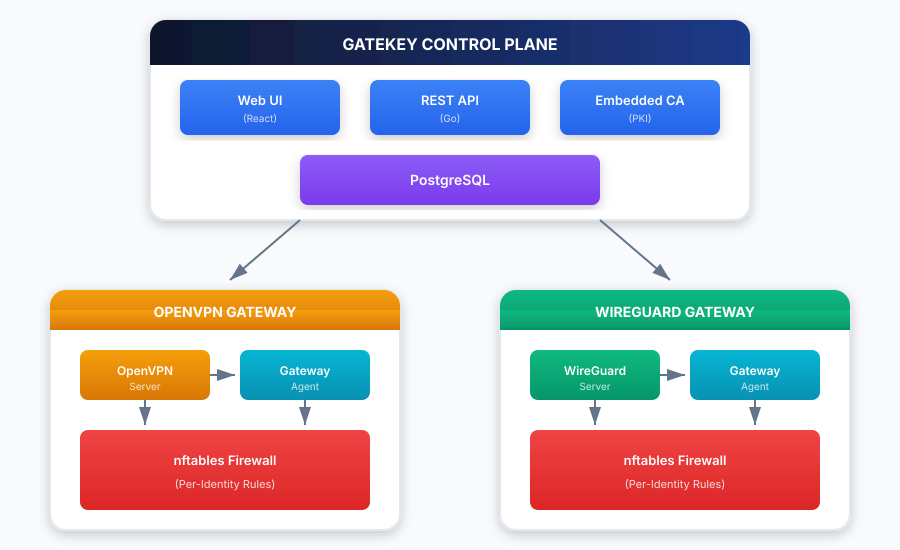
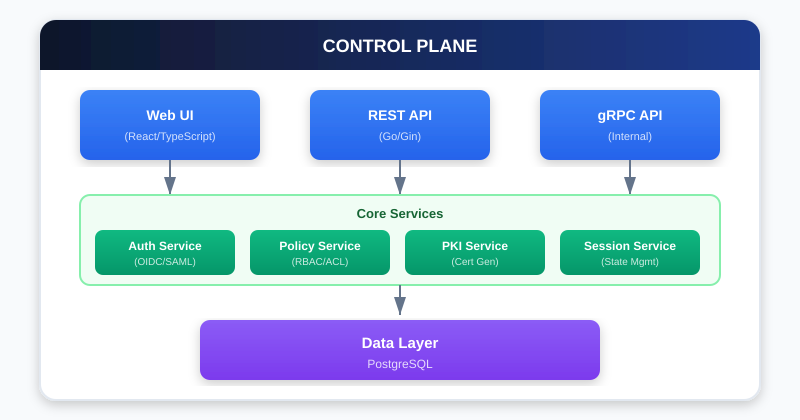
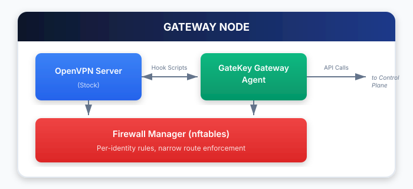
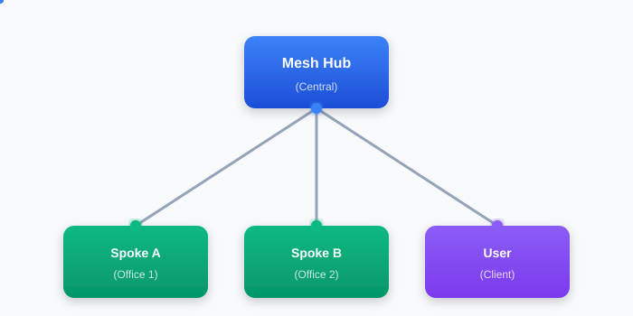
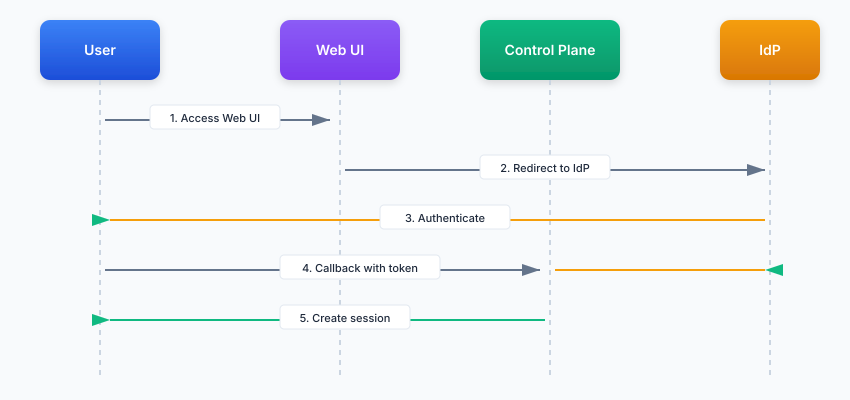
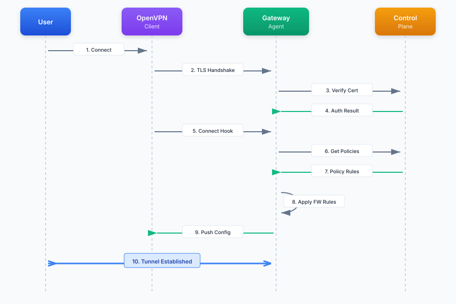

# GateKey Architecture

## Overview

GateKey is a Software Defined Perimeter (SDP) solution that wraps OpenVPN and WireGuard to provide zero-trust VPN capabilities while maintaining 100% compatibility with existing VPN clients.



## System Components

### Control Plane (`gatekey-server`)

The control plane is the central management component that handles:

- **Authentication**: OIDC and SAML integration with identity providers
- **Authorization**: Policy-based access control
- **Certificate Management**: Embedded PKI for short-lived certificates
- **Configuration Generation**: Dynamic .ovpn/.conf file generation
- **Session Management**: User session tracking and validation
- **Gateway Management**: Registration and monitoring of gateway nodes
- **Audit Logging**: Comprehensive audit trail



### Gateway Agent (`gatekey-gateway`)

The gateway agent runs alongside OpenVPN on each gateway node:

- **Hook Handling**: Processes OpenVPN hook callbacks
- **Firewall Management**: Per-identity nftables/iptables rules
- **Connection Reporting**: Reports connection state to control plane
- **Health Monitoring**: Sends heartbeats to control plane



### Mesh Hub (`gatekey-hub`)

The mesh hub enables site-to-site VPN connectivity using a hub-and-spoke topology:

- **OpenVPN Server**: Runs the mesh OpenVPN server for spoke connections
- **Route Aggregation**: Collects routes from all connected spokes
- **Client VPN Access**: Allows authorized users to connect as VPN clients
- **Control Plane Sync**: Syncs configuration and access rules from control plane
- **Health Monitoring**: Sends heartbeats to control plane



### Mesh Spoke (`gatekey-mesh-gateway`)

The mesh spoke connects remote sites to the mesh hub:

- **Outbound Connection**: Initiates connection to hub (works behind NAT)
- **Local Network Advertisement**: Advertises local networks to the hub
- **Automatic Reconnection**: Maintains persistent connection to hub
- **Control Plane Sync**: Receives configuration updates

### WireGuard Gateway Agent (`gatekey-wireguard-gateway`)

The WireGuard gateway agent provides an alternative to OpenVPN gateways:

- **WireGuard Interface Management**: Creates and manages wg0 interface
- **Peer Synchronization**: Syncs authorized peers from control plane
- **Firewall Management**: Per-peer nftables rules with zero-trust
- **Connection Reporting**: Reports peer handshakes and traffic stats
- **Health Monitoring**: Sends heartbeats to control plane

#### WireGuard vs OpenVPN Gateway

| Feature | OpenVPN Gateway | WireGuard Gateway |
|---------|-----------------|-------------------|
| Binary | `gatekey-gateway` | `gatekey-wireguard-gateway` |
| Protocol | UDP or TCP | UDP only |
| Port | 1194 (default) | 51820 (default) |
| Client Auth | X.509 Certificates | Public Key |
| Config Format | `.ovpn` | `.conf` |
| Cryptography | Configurable | Fixed (Curve25519, ChaCha20) |

## Data Flow

### User Authentication Flow



### VPN Connection Flow



### Permission Flow


## Security Model

> **For detailed security documentation, see [security.md](security.md)**

### Zero Trust Principles

1. **Never Trust, Always Verify**: Every connection is authenticated and authorized
2. **Least Privilege**: Users only access resources explicitly allowed by policy
3. **Assume Breach**: Short-lived certificates limit exposure window
4. **Continuous Verification**: Sessions are validated on each connection
5. **Default Deny**: All traffic is blocked unless explicitly allowed by access rules

### Defense in Depth

Security is enforced at three points:

1. **Config Generation**: User must have gateway access to generate VPN config
2. **Connection Verification**: Gateway re-verifies user access at connection time
3. **Firewall Enforcement**: Per-user firewall rules with default DENY policy

This means even if a user obtains a valid `.ovpn` file, they cannot bypass security:
- Access is re-checked when they connect
- Only traffic to explicitly permitted destinations is allowed
- Certificate is bound to specific gateway

### Certificate Lifecycle

Certificates are short-lived (24 hours default) and automatically expire. Users must re-authenticate to get new certificates.

### Firewall Rules

Per-identity firewall rules are applied at the gateway level:

```
# Example nftables rules for user "alice@example.com"
table inet gatekey {
    chain forward {
        type filter hook forward priority 0; policy drop;

        # Allow traffic from alice's VPN IP to allowed networks
        ip saddr 10.8.0.5 ip daddr 192.168.1.0/24 accept
        ip saddr 10.8.0.5 ip daddr 10.0.0.10 tcp dport 443 accept

        # Drop all other traffic from this VPN IP
        ip saddr 10.8.0.5 drop
    }
}
```

## Database Schema

### Core Tables

- **users**: User accounts synced from IdP
- **sessions**: Active user sessions
- **certificates**: Issued certificates for revocation tracking
- **policies**: Access control policies
- **policy_rules**: Rules within policies
- **gateways**: Registered gateway nodes
- **connections**: Active and historical VPN connections
- **audit_logs**: Audit trail

### Mesh Networking Tables

- **mesh_hubs**: Mesh hub configurations and status
- **mesh_spokes**: Spoke gateways connected to hubs
- **mesh_hub_users**: User access assignments to hubs
- **mesh_hub_groups**: Group access assignments to hubs
- **mesh_hub_networks**: Network assignments to hubs (zero-trust)
- **mesh_spoke_users**: User access assignments to spokes
- **mesh_spoke_groups**: Group access assignments to spokes

### Entity Relationships


## Deployment Architecture

GateKey supports single-region and multi-region deployments. See the [deployment guide](deployment.md) for detailed instructions.

## Technology Stack

### Backend
- **Language**: Go 1.25+
- **Web Framework**: Gin
- **Database**: PostgreSQL
- **Authentication**: OIDC (go-oidc), SAML (crewjam/saml)
- **Firewall**: nftables (google/nftables)

### Frontend
- **Framework**: React 18
- **Language**: TypeScript
- **Styling**: Tailwind CSS
- **Bundler**: Vite

### Infrastructure
- **VPN**: OpenVPN (stock)
- **Container**: Docker (optional)
- **Orchestration**: Kubernetes (optional)

## See Also

- [Mesh Networking Guide](mesh-networking.md) - Hub-and-spoke VPN topology
- [Security Documentation](security.md) - Security model and best practices
- [API Reference](api.md) - REST API documentation
- [Client Guide](client.md) - CLI client usage
